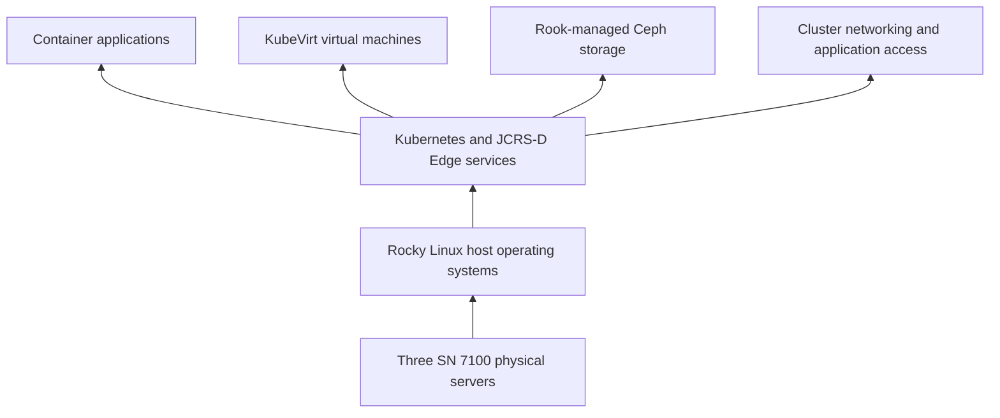

# JCHK JCRS-D and Kubernetes

**JCRS-D** means Joint Cyber Warfighting Architecture (JCWA) Common Runtime Stack for Data. Its **Edge** form supplies the common computing platform in the deployable JCHK. Here, **runtime** means the environment in which software executes, and **edge** means computing located near the operational collection environment rather than depending entirely on a distant enterprise service.

In the documented Kit, three SN 7100 servers at Hunt Site 1 run JCRS-D Edge on secured **Rocky Linux**, a Linux operating system. The shared platform hosts applications in containers and virtual machines using **Kubernetes, KubeVirt, and Rook/Ceph**.

## The layers, from hardware to application

A **container** packages a running application and its dependencies while sharing the host's operating-system kernel. A **kernel** is the central part of the OS that manages hardware resources. A **virtual machine (VM)** runs its own guest OS. Kubernetes coordinates workloads across the machines; it is not itself an operating system. KubeVirt extends Kubernetes so it can manage VMs as well as ordinary container workloads. [[JCHK Virtual Machines and Containers]] develops that distinction.

## Kubernetes vocabulary through one example

**Kubernetes** is an orchestration system: it places, monitors, and manages applications across a group of computers. Consider a team collaboration application:

| Term | Meaning in plain language | Role in the example |
|---|---|---|
| Cluster | All machines managed together | The three SN 7100s and their Kubernetes services |
| Node | One participating physical or virtual machine | One SN 7100 host |
| Control plane | Components that manage desired cluster state and scheduling | Decides where a workload should run and records its state |
| API | Application programming interface, the structured way software requests actions | Used by management tools to query or change objects |
| Pod | Kubernetes' smallest deployable workload unit; can contain one or more containers | Runs an application's component |
| Deployment | A controller-managed description of a set of pods and its updates | Keeps the requested number of an application component running |
| Namespace | A logical naming and organization boundary within a cluster | Groups the application's resources |
| Service | A stable access point for a changing set of pods | Lets clients reach the application despite pod replacement |
| Manifest | A file declaring the desired objects and their settings | States which image, resources, and connections the application requires |

A **controller** continually compares desired and observed state and acts to reconcile them. **Declarative configuration** describes the desired result instead of manually enumerating every operation. Manifests usually use **YAML**, a human-readable structured-data format; **JSON** is another structured-data format. The tool `kubectl` is the Kubernetes **command-line interface (CLI)**, meaning it is operated through typed commands.

Two names in the control-plane lesson are **kube-apiserver**, the component that accepts Kubernetes API requests, and **etcd**, the key/value data store used for cluster state. A **key/value store** associates an identifying key with stored information. This cluster configuration store serves a different purpose from an application's searchable evidence database.

The example explains relationships; it is not a claim about Mattermost's exact installed object layout or number of replicas. A **replica** is an additional managed copy of a workload or data, with behavior depending on the particular component.

## The named JCRS-D services

| Component | Job in the supplied material |
|---|---|
| Navigator | Portal through which users reach JCRS-D applications |
| Rook / Ceph | Automation and distributed storage providing redundant cluster storage |
| NiFi | Dataflow processing: moving and transforming data through defined pipelines |
| Elasticsearch | Search and analytics through indexed data |
| Unity / Ionic | Integration with BDP; Lesson 6 associates Unity with JCRS-D Edge 1.0.x and Ionic with 2.0.x |
| Citadel | User-management and authentication component |
| Cilium | Cluster networking/security component named by Volume 1 |
| Traefik | Routes incoming application connections to the intended services |

**BDP**, Big Data Platform, is the enterprise data-platform integration referenced by the course. The acronym and general ingest, storage, and analytics role are also described by [USCYBERCOM's public BDP portal](https://scarif.cybercom.mil/). **Authentication** establishes who a user is; **authorization** determines what that identity may do. **Ingress** is incoming access to services; a **reverse proxy** accepts a client connection and relays it to a backend service; a **load balancer** distributes connections among backends. Traefik provides these functions in the Kit's application-access design.

Do not read the integration roadmap as proof that all data already flows into one enterprise repository. Lesson 6 lists data integration, FreeIPA/Citadel/Keycloak authentication integration, and further container adoption as roadmap work. The Kit's ability to operate disconnected is separate from its ability to integrate with an external platform.

## Storage objects and an important source correction

A **PersistentVolume (PV)** represents storage available to workloads. A **PersistentVolumeClaim (PVC)** is a workload's request for that storage. A **StorageClass** describes a type of storage and how it should be provisioned. “Persistent” means the storage lifecycle is independent of a particular short-lived pod; it does not promise backup or unlimited retention.

Lesson 6 PDF p. 21 mistakenly says PVCs are outside namespaces. **PVCs are namespaced; PVs and nodes are cluster-scoped.** This correction follows the official [Kubernetes Persistent Volumes documentation](https://kubernetes.io/docs/concepts/storage/persistent-volumes/#a-note-on-namespaces) and [namespace documentation](https://kubernetes.io/docs/concepts/overview/working-with-objects/namespaces/#not-all-objects-are-in-a-namespace). A namespace alone also does not automatically enforce complete network isolation; policy and access controls matter.

## Reading status without confusing it with complete readiness

Lesson 6 introduces read-only checks such as `kubectl get nodes`, `kubectl get all -n jcrsd`, and `kubectl get vmis --all-namespaces`. `-n` chooses a namespace. `vmis` means VirtualMachineInstances, the running VM objects. `describe` and `logs` provide details and recorded output when a workload behaves unexpectedly.

A node marked Ready is evidence that the node is available to Kubernetes. It is not proof that every application, disk, route, certificate, and sensor is healthy. Similarly, `get all` returns a conventional subset of resource types, not literally every object. Application readiness should be checked through the application and its dependencies as well as the cluster status. These notes document the checks; no Kit commands were executed to produce them.

## Sources

- [[JCHK Sources#V1|Volume 1]], PDF pp. 56–60: platform layers, extension roles, networking, placement.
- [[JCHK Sources#L06|Lesson 6]], PDF pp. 6–8, 17–33: purpose, Kubernetes vocabulary, components, status commands, roadmap.
- [[JCHK Sources#APP|Appendices]], PDF p. 10: SN 7100 application/platform inventory.
- Official Kubernetes references linked above clarify the source's PVC error; they do not imply that the latest Kubernetes release is installed in JCHK v0.6.1.

## Related notes

[[JCHK Start Here]] · [[JCHK Sites and System Architecture]] · [[JCHK Virtual Machines and Containers]] · [[JCHK Storage Capacity and Retention]] · [[JCHK Service Portal and Identity]] · [[JCHK Software Map and Baseline]]
