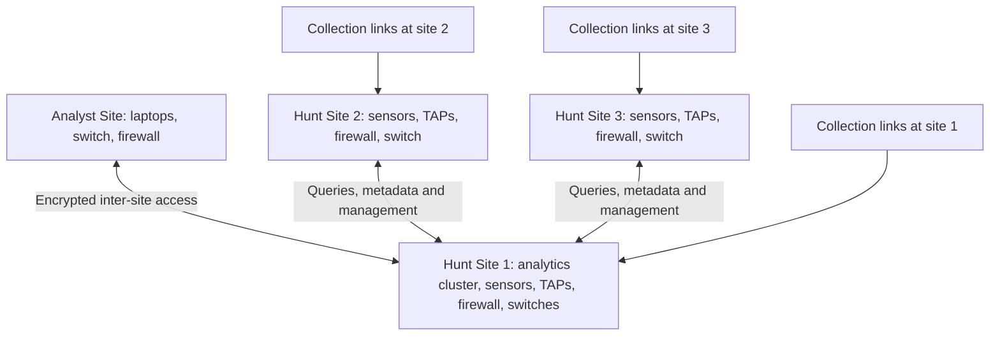

# JCHK Sites and System Architecture

The documented JCHK arrangement has one **Analyst Site**, one **Primary Hunt Site**, and two **Secondary Hunt Sites**. A site's name identifies its job. The Analyst Site is where people normally work; Hunt Site 1 hosts the central application platform; all three Hunt Sites contain collection sensors.

**Architecture** describes the major parts of a system and how they interact. **Topology** is the arrangement of connections between those parts. The diagram below is a conceptual architecture, not a cable-to-port wiring plan.

**Encryption** makes data unreadable to parties without the required cryptographic keys. A **virtual private network (VPN)** carries protected network communication through another network. The default documents use WireGuard for inter-site VPN tunnels. A **tunnel** is a logical connection carried inside other traffic. The diagram does not enumerate every peer relationship or routing rule; see the networking notes for the exact baseline.

## What each site contains

| Site | Principal installed components in the default layout | Operational purpose |
|---|---|---|
| Analyst Site | Analyst laptops, one QNAP access switch, one Netgate 6100 firewall | Operator access to applications and local desktop tools |
| Hunt Site 1 | Three SN 7100 analytics servers, one SN 9000 sensor, one SN 3100 sensor, one FW 3100 firewall, four QNAP switches, two ASF01 TAPs | Central application hosting plus local collection |
| Hunt Site 2 | One SN 9000, one SN 3100, one FW 3100, one QNAP switch, two ASF01 TAPs | Collection and storage near another network location |
| Hunt Site 3 | Same primary equipment profile as Hunt Site 2 | A third collection location |

The Kit also includes three MS 100 **flex servers**, small computers available for spare compute or other assigned functions. Their full inventory count is distinct from the one MS 100 shown in the example Hunt Site 1 power configuration. The precise active placement depends on the build.

## The Analyst Site is an access location

A **workstation** is a computer a person uses directly. Analyst workstations run local tools and connect to central applications. A **switch** joins devices within a local network; a **firewall** enforces communication rules and, in this design, also routes traffic and provides VPN connectivity. A **router** moves traffic between networks.

The default inventory contains nine laptops. The cabling diagrams distinguish laptop 1 as a deployment laptop at Hunt Site 1 and show laptops 2–9 at the Analyst Site. That is consistent with nine supplied laptops; it does not imply a tenth computer. The narrative says nine laptops at the Analyst Site, while maximum expansion is given as fourteen in Lesson 1 and fifteen in Volume 1. Treat those as unresolved layout/capacity statements, not a reason to fill every physical port without checking its assigned function.

## Hunt Site 1 provides the common application platform

The three SN 7100 servers form a **cluster**, meaning several computers managed together as one service platform. Each participating machine is a **node**. Their JCRS-D Edge platform runs shared analysis applications through Kubernetes and KubeVirt; [[JCHK JCRS-D and Kubernetes]] explains those names.

Central services include Security Onion management/search roles and endpoint-investigation services. **Centralized analysis** means analysts have a common investigation interface. It does not mean all original packets are copied into the central servers. Sensor storage and cluster storage serve different purposes.

The high-speed QNAP switches associated with the analytics servers provide their internal connections. This is why all three Case 1 groups can be physically consolidated at Hunt Site 1 even though they began as parts of separate transport stacks.

## Secondary sites provide distributed collection

**Distributed collection** places capture equipment close to the links being monitored. Each secondary site has both a large and small sensor. The large SN 9000 keeps packet capture and indexed metadata locally; the small SN 3100 keeps packet capture locally and sends metadata to the central Security Onion roles. **Indexing** organizes data so that searches can find it efficiently.

A secondary site therefore does perform local processing. “No central analytics hosting” means it lacks the three-node shared application cluster; it does not mean its sensors merely relay raw traffic without examining it. This distinction resolves otherwise confusing wording in the overview.

## Physical and logical separation

A **physical connection** is an actual cable or radio link. A **logical network** is a software-defined communication grouping. A **virtual LAN (VLAN)** divides a switched network into separate logical networks, even when some cables and switches are shared. A **trunk** carries multiple VLANs across a link. The Kit uses these distinctions to separate provisioning, infrastructure, management, application, and mission-facing traffic.

**Provisioning** is the installation and configuration process. Some pre-deployment connections exist to support it and are removed or changed for normal operations. Use the correct pre- or post-deployment wiring plan rather than combining them.

## Sources and interpretation

- [[JCHK Sources#V1|Volume 1]], PDF pp. 9–10, 21–28: site roles, data flow, hardware allocations, and resource summaries.
- [[JCHK Sources#L01|Lesson 1]], PDF pp. 9–14: four-site structure, workstation count discrepancy, future models.
- [[JCHK Sources#APP|Appendices]], PDF pp. 10–11, 28–45: platform roles and packaging.
- Supplied July 22, 2026 cabling diagrams: laptop placement and temporary deployment links, indexed in [[JCHK Sources]].

The diagram and the explanations distinguishing site, stack, and local processing are synthesis of these sources. See [[JCHK Source Discrepancies]] for ambiguous source wording.

## Related notes

[[JCHK Start Here]] · [[JCHK What the Kit Is]] · [[JCHK Data Journey and Resilience]] · [[JCHK Kit Inventory and Packaging]] · [[JCHK JCRS-D and Kubernetes]]
