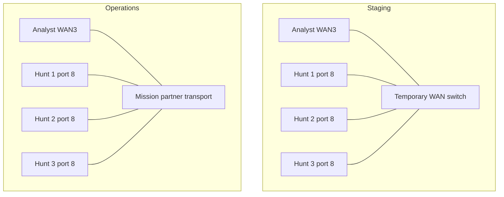

# JCHK Cabling and Deployment States

Up: [[JCHK Start Here]] · Read next: [[JCHK Hunt Site 1 Cabling]] and [[JCHK Remote and Analyst Site Cabling]]

## Why there are two wiring diagrams

**Provisioning** means installing operating systems, applying configuration, and preparing services. The JCHK's **pre-deployment topology** creates the staging connections needed to do that work. **Post-deployment topology** is the operational arrangement after temporary provisioning links are removed and mission connections are supplied. “Post-deployment” here does not mean the mission has ended.

Both states retain the essential cluster, hardware-management, and infrastructure links. The transition removes specific temporary links; it is not a teardown of all wiring. A **persistent connection** is one intended to remain through the transition. The original dated diagrams are indexed in [[JCHK Sources#Cabling diagrams|JCHK Sources]]; they are physical diagrams, while the simpler diagrams below explain purpose.

## The eight connection purposes

| Purpose | What it connects | Pre-deployment | Operations |
| --- | --- | --- | --- |
| Temporary WAN | All four site firewalls through a spare switch | Provides staging intersite transport | Removed/replaced for mission transport; may remain appropriate for a deliberate isolated training arrangement |
| Mission partner WAN | Site firewall WAN ports to partner transport | Normally absent in staging | Carries intersite VPN traffic |
| Analyst access | Analyst laptops, Analyst switch, Analyst firewall | Present | Present |
| Provisioning | Installation interfaces and temporary intersite switch uplinks | Present for imaging and automation | Temporary cables removed after validation |
| JCRS-D cluster | Three SN 7100 servers and three high-speed switches at Hunt 1 | Present | Remains |
| MGMT / IPMI | Hardware management controllers to management network | Present | Remains |
| Infrastructure | Operating-system and service network interfaces | Present | Remains |
| TAP ingest | Traffic-copy outputs to sensor monitor inputs | May be staged/tested | Connected where the mission needs network visibility |

**TAP**, traffic access point, is a device that supplies a copy of network traffic. **SPAN**, switched port analyzer/port mirroring, is a switch feature that can supply copied traffic instead. The diagrams show TAP examples; a mission can use a suitable SPAN source. Neither a sensor management connection nor a VPN tunnel is a replacement for the physical capture feed.

## Read the original diagram legend

| Line style | Meaning | Plain description |
| --- | --- | --- |
| Solid blue | CAT6 | Category 6 copper Ethernet cable, commonly with RJ45-style plugs |
| Dashed red | SFP+ DAC | Direct-attach copper cable using SFP+ connectors; the listed JCHK links are 10 GbE |
| Dotted purple | QSFP28 DAC | Direct-attach cable for the high-speed cluster connections; the listed links use 100 GbE |
| Green dash-dot | Varies, TAP | Media selected to match the tapped link, TAP output, and sensor input |

**GbE** means gigabit Ethernet, an Ethernet link rate expressed in billions of bits per second. A **transceiver** converts electrical/optical signals and provides an interface for a cable. **SFP**, small form-factor pluggable, and its SFP+/SFP28 variants are connector/module families; **QSFP28** is a quad small form-factor pluggable family. Connector shape alone does not guarantee compatible speed, cable, or module support. A faster-capable cage can operate at a lower compatible rate with the approved module.

A **DAC**, direct-attach cable, includes its connector modules. Do not treat it as a loose fiber cable needing separate optical transceivers. **RJ45 transceivers** allow the specified copper Ethernet connections through suitable pluggable cages. **LC** is a small fiber connector; **OM4** is multimode fiber and **OS2** is single-mode fiber. Match fiber type, wavelength, reach, and device/module compatibility using the approved component information.

The small curved line bridges in the drawings indicate crossing wires, not junctions. Identify the actual endpoint dot and port; do not infer a cable connection from a visual crossing. Labels such as `switch-1` are local to a site: Hunt 2 switch-1 is a different device from Hunt 1 switch-1.

## Staging versus operational intersite links

During staging, additional temporary SFP+ links join Hunt 1 switch-2 to Hunt 2's switch and Hunt 1 switch-3 to Hunt 3's switch. These carry provisioning connectivity and do not mean the remote operational sites must remain attached by short direct cables to Hunt 1. The deployed operational connection uses routed encrypted tunnels across available transport.

A separate Hunt 1 **MISSION** service connection, port 6, is explained in [[JCHK Mission Partner Connectivity]]. It is not fully represented in these eight PNGs, whose MPN lines emphasize WAN transport.

## A readable transition checklist

1. Identify each cable by **site, device, physical port, purpose, and destination**, not by color alone.
2. Confirm the deployment and required validations are complete before disconnecting provisioning paths.
3. Record a working configuration and label both ends of cables.
4. Remove the temporary provisioning links and staging-only intersite switch uplinks identified in the wiring plan. Preserve JCRS-D, MGMT/IPMI, infrastructure, and analyst links.
5. Move each WAN connection from temporary transport to its assigned operational transport and apply the approved site addressing.
6. Add the mission-specific sensor feeds and separate mission-service interface where required.
7. Validate hardware management, normal management, intersite tunnels, application access, and observed sensor data as separate checks.

The port tables in the following notes preserve the Wiring Guide's values and explicitly call out contradictions. A lit interface proves a physical signal, not the right VLAN, routing, service health, or absence of packet loss.

## Sources and related notes

[[JCHK Sources#WIRE|Wiring Guide]], PDF pp. 1–8, 10–12, 22–36; all eight [[JCHK Sources#Cabling diagrams|22 July 2026 cabling diagrams]]. Related: [[JCHK Deployment Roadmap]], [[JCHK Network Fundamentals]], [[JCHK TAPs and Traffic Visibility]], [[JCHK Source Discrepancies]].
