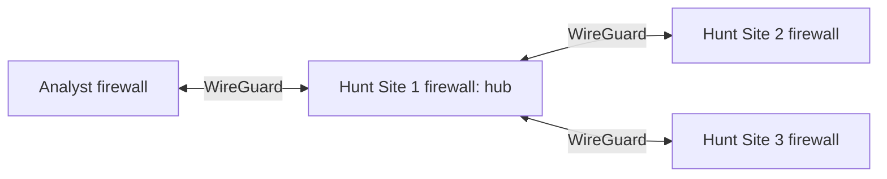

# JCHK Firewalls and WireGuard

Up: [[JCHK Start Here]] · Prerequisite: [[JCHK Network Fundamentals]]

## What the firewall does

Each logical site has a **firewall**, which applies traffic-permission rules, routes between networks, and participates in the encrypted site connections. The software is **pfSense Plus**, running directly on firewall hardware, also called **bare metal**. Three SealingTech FW 3100s serve Hunt Sites 1–3; a Netgate 6100 MAX serves the default Analyst Site. Kit inventory includes additional Netgate appliances; inventory count and number used in the standard topology are different questions.

The site firewall separates functional VLANs as well as connecting sites. **Segmentation** means dividing a network into controlled areas. A VLAN supplies separation at Ethernet level; firewall rules determine which routed conversations are allowed between those areas. Do not equate successful physical cabling with permission for every service.

## Physical interfaces and logical interfaces

| Function | FW 3100 | Netgate 6100 in Analyst Site |
| --- | --- | --- |
| WAN: intersite transport | Physical port 8, operating-system name `ice1` | WAN3, `ix0` |
| LAN: internal VLAN trunk | Physical port 7, `ice0` | LAN1, `igc0` |
| Dedicated mission service connection | Hunt 1 port 6, `ix1`, named MISSION | Not the same role as Analyst WAN3 |

**LAN** is local area network; **WAN** is wide area network. Here WAN means the path that carries traffic between site firewalls. It does not necessarily mean the public Internet. A **subinterface** is a logical network interface on a physical port, such as one VLAN-specific interface on the LAN trunk. Physical port numbers, operating-system interface names, and pfSense display labels are separate naming systems.

Firewall management is documented on INFRA/VLAN 10: Analyst 10.1.1.1, Hunt 1 10.1.17.1, Hunt 2 10.1.33.1, Hunt 3 10.1.49.1 in Lesson 4. The actual deployed values take precedence; see [[JCHK Network Address Plan]].

## The VPN is a hub and spokes

A **VPN**, virtual private network, creates an encrypted connection over another network. An **endpoint** is the outer address and port used to reach a VPN peer. A **peer** is the firewall at the other end. The JCHK automation configures **WireGuard**, a VPN protocol, with Hunt Site 1 as the **hub**. The Analyst Site and Hunt Sites 2 and 3 are **spokes**.

The diagram shows logical encrypted connections, not exact cables. Three tunnels end at the hub. A spoke-to-spoke conversation passes through the hub under the configured routing and firewall rules. A healthy switch or local sensor at a remote site does not remove its dependency on the hub for central service access.

**Underlay** is the network carrying the tunnel's outer packets: the temporary staging WAN or mission-provided transport. The **tunnel network** contains the inner IP addresses used for the routed virtual link. Its addresses are distinct from the firewall's WAN endpoint addresses. Lesson 4 describes three `/30` tunnel networks; the source sets disagree on the exact numbers.

## Routes, encryption, and permissions each solve a different problem

1. The outer WAN path must let the peers reach each other.
2. WireGuard must establish cryptographic peer communication. Its **handshake** exchanges information needed for a secure session.
3. Routes must send destination networks to the correct tunnel next hop.
4. Firewall rules must permit the intended traffic.
5. The destination service must be available, and replies must have a return path.

Lesson 4's example sends a Hunt 2 next hop to the Hunt 1 end of its tunnel, `10.1.254.5`. Treat that as the lesson's example, not a value to mix with Appendix C's different tunnel plan. **NAT**, network address translation, rewrites IP address information; it is separate from routing and encryption. For mission-service NAT see [[JCHK Mission Partner Connectivity]].

## Read-only verification sequence

Start with the user's symptom and record which site, destination, and time are affected. Confirm the local client has the intended IP settings and can reach its gateway. Inspect the firewall's interface status and WAN addressing. Inspect WireGuard tunnel status for a recent handshake and traffic. Inspect routes and firewall logs for the specific source/destination pair. Then test the application's name and service port. A green handshake alone is not proof that the entire application path works.

If every remote site loses central applications at once, examine the shared hub and central-service dependencies. If one site fails, compare its local link, addressing, tunnel, and rules. If only one service fails across all sites, examine that service and its dependencies rather than rebuilding all firewalls.

## Sources and related notes

[[JCHK Sources#L04|Lesson 4]], PDF pp. 12–28; [[JCHK Sources#V3|Volume 3]], PDF pp. 28–34; [[JCHK Sources#APP|Appendices]], PDF pp. 16–24. Related: [[JCHK Sites and System Architecture]], [[JCHK Troubleshooting and Recovery]], [[JCHK Source Discrepancies]].
