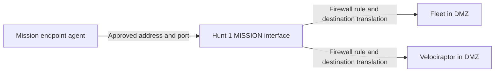

# JCHK Mission Partner Connectivity

Up: [[JCHK Start Here]] · Prerequisite: [[JCHK Firewalls and WireGuard]]

## Two purposes that the diagrams can make look alike

The **mission partner network (MPN)** is the organization's environment supporting the hunt. It can provide transport between separated kit sites and contain the endpoints being investigated. An **endpoint** in this context is a host such as a workstation or server; in a VPN discussion the same word means a tunnel peer's address.

The sources describe two distinct physical firewall functions:

| Purpose | Physical connection | What it carries |
| --- | --- | --- |
| Intersite WAN transport | Every FW 3100 port 8; Analyst Netgate WAN3 | Outer packets for site-to-site WireGuard connectivity |
| Mission-facing tool access | Hunt Site 1 FW 3100 port 6 / `ix1`, called MISSION | Selected connections between mission endpoints and services in the kit DMZ |

The supplied post-deployment cabling PNGs emphasize the WAN transport connection. They do **not** fully draw the separate port-6 MISSION service connection from Lesson 4 and Volume 3. A cable to the MPN cloud in a picture therefore does not prove that Fleet or Velociraptor has been published to partner hosts.

## What the DMZ accomplishes

A **DMZ**, demilitarized zone, is a separate network used to expose selected services through controlled paths. JCHK's documented default is VLAN 50, `10.1.21.0/24`. Security Onion Fleet and Velociraptor have endpoint-facing services there. The DMZ does not mean “unrestricted” or make a service automatically safe. Rules should match the mission's approved sources, destinations, and functions.

Before configuration, obtain the partner-approved IP address and prefix/mask, gateway, relevant DNS arrangement, routing/port permissions, and expected endpoint ranges. Compare address space for overlap. Volume 3 assumes a static partner address in its example, though it acknowledges DHCP as another interface option. **Static** means explicitly assigned rather than leased automatically.

## Understand the translated connection

**PAT**, port address translation, is a form of NAT that lets multiple internal connections share an external address by translating ports. **Outbound NAT** handles connections initiated toward the external network. A **port forward** maps traffic arriving at a selected external address and port to a selected internal host and port.

For a mission endpoint initiating an agent connection, the documented v0.6.1 mappings are:

| Partner-facing destination | Protocol | Internal destination | Purpose |
| --- | --- | --- | --- |
| MISSION address, port 8220 | TCP | 10.1.21.30:8220 | Elastic Agent connection to Fleet |
| MISSION address, port 5055 | TCP | 10.1.21.30:5055 | Additional Elastic endpoint data path |
| MISSION address, port 8000 | TCP | 10.1.21.70:8000 | Velociraptor client communication |

Source: Volume 3 Table 4.5, PDF p. 32. These are the source baseline, not automatically discovered live settings. A **listener** is the server process accepting connections at the destination port. Forwarding a port is insufficient if the listener is absent, the associated firewall rule denies traffic, the client uses the wrong address, or the return path is wrong.

## Gateway and management exposure

The source procedure makes the mission gateway the kit's default external gateway and relies on pfSense Automatic Outbound NAT. A default-route change can affect more than the intended agent connection, so compare the resulting routing and NAT rules with the planned traffic paths.

Volume 3 also warns that naming/assigning a mission interface as LAN may create an **anti-lockout rule** that permits firewall administration over it. An anti-lockout rule preserves management access, but the mission-facing interface should not unintentionally expose the firewall's web or SSH administration. Preserve a working authorized management path, inspect the generated rule, and follow the approved configuration procedure; do not disable access protections blindly and lock out administrators. This is a documented configuration concern, not an instruction that was executed while creating these notes.

## Names and certificates across NAT

A TLS **certificate** identifies a service and is checked against the name or address requested by the client. The internal name, partner DNS response, external translated address, certificate names, and agent server setting need to agree. DNS does not automatically know the kit's private domain. See [[JCHK Elastic Agent and Fleet]] and [[JCHK Service Portal and Identity]].

Some training examples disable certificate checks. Such a lab shortcut does not repair the underlying trust or naming problem. Use the deployment's intended trust chain and actual server name when forming an operational configuration.

## Validate the whole path

Use a designated test endpoint and the intended client package. Confirm name resolution, network reachability to the precise service port, successful certificate validation, agent enrollment, recent check-in, and arrival of meaningful events. **Enrollment** registers an agent with its management service. A successful installer exit is not the same as verified telemetry. **Telemetry** is the observations an agent sends about the host.

## Sources and related notes

[[JCHK Sources#L04|Lesson 4]], PDF pp. 30–34; [[JCHK Sources#V3|Volume 3]], PDF pp. 29–34, 48–52; [[JCHK Sources#WIRE|Wiring Guide]], PDF pp. 22–24. Related: [[JCHK Velociraptor Endpoint Forensics]], [[JCHK Network Address Plan]], [[JCHK Source Discrepancies]].
