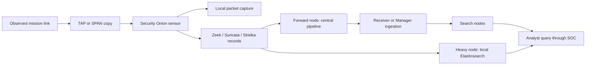

# JCHK Security Onion Architecture

[[JCHK Start Here]] · [[JCHK Software Map and Baseline]]

**Security Onion** is the JCHK's primary platform for network security monitoring, threat hunting, and log analysis. **Network security monitoring (NSM)** observes communications for security-relevant behavior. **Threat hunting** is a structured investigation of a hypothesis about suspicious activity, including activity that did not produce an alert.

The platform separates collection, transport, storage, querying, and administration across different **nodes**: computers or virtual machines assigned particular roles. The JCHK materials describe a distributed deployment on Oracle Linux 9.

## Node roles

| Node | Principal responsibility | Where/why it matters |
|---|---|---|
| Manager | Administration, Security Onion Console, cluster coordination, queries | Central analyst entry point in JCRS-D |
| Receiver | Additional ingestion pipeline with Logstash and Redis | Reduces Manager ingestion bottlenecks and provides pipeline redundancy |
| Search | Indexes and stores searchable logs/metadata in Elasticsearch | Answers central searches |
| Fleet | Enrolls and manages Elastic Agents; receives endpoint telemetry | JCRS-D service in the DMZ |
| Forward sensor | Captures packets locally; forwards logs and metadata | SN 3100 baseline role |
| Heavy sensor | Captures packets and indexes metadata locally | SN 9000 baseline role; useful with constrained or unreliable inter-site links |

**DMZ**, demilitarized zone, means a network segment separating services that must communicate with external endpoints from more protected kit infrastructure. **Ingestion** is the process of receiving data into an analysis pipeline. **Indexing** organizes data so searches can find it efficiently.

## Follow a network event

This is a conceptual flow, not a cable diagram. Full **PCAP (packet capture)** remains on sensor storage in the documented design; metadata is smaller and more practical to move between sites. A Heavy node can be queried through **cross-cluster search**, meaning the query reaches a separate Elasticsearch cluster. A Forward node depends on the central metadata pipeline. Local capture alone does not prove the central index has caught up.

The exact route for a log depends on node role and deployed settings. Lesson 9's brief Receiver description is narrower than Lesson 8's detailed pipeline description; use the node-role descriptions and actual configuration rather than reading the one-line description as an exhaustive traffic policy.

## The analysis engines

**Zeek** parses network protocols and emits descriptive records: who communicated, when, and using which protocol. A **protocol** is a set of rules for communication, such as DNS or HTTP.

**Suricata** is the documented intrusion detection and full-packet-capture engine. An **intrusion detection system (IDS)** identifies patterns that may indicate malicious activity. A **signature** or detection rule expresses a recognizable pattern. An IDS alert is a lead, not a verdict that compromise occurred.

**Strelka** analyzes extracted files and produces file metadata or matches, including **YARA** rules: patterns used to identify characteristic content in files. Not every flow contains an extractable file, and an encrypted payload is not automatically visible to a network sensor.

**Elastic Agent** forwards the sensor-generated records. **Logstash** receives/transforms data. **Redis** supplies a queue, a temporary waiting area that decouples arrival from processing. **Elasticsearch** stores and searches indexed records. **Kibana** provides an interface for queries and visualizations. **ElastAlert2** supports alerts based on Elasticsearch data. These are complementary stages; “Security Onion is running” does not tell you which stage is working.

## The Console and practical implications

The **Security Onion Console (SOC)** runs on the Manager. In these notes SOC means that interface, not the broader organizational term “security operations center.” Use the service URL in JAKD; training examples show `http://so-manager.kit1.jchk`.

A Receiver continuing ingestion during a Manager outage does not guarantee that the analyst web interface remains available. A healthy web interface does not guarantee complete packet capture. A local sensor may retain packets through a connectivity interruption while central searches become stale. Investigate each layer independently.

## Related notes

[[JCHK TAPs and Traffic Visibility]] · [[JCHK Security Onion Investigation Workflow]] · [[JCHK Sensor Health and Packet Loss]] · [[JCHK Elastic Agent and Fleet]]

## Sources

- [[JCHK Sources#L08|Lesson 8]], PDF pp.33–41, especially the logical architecture figure on p.35 and node details on pp.36–40.
- [[JCHK Sources#L03|Lesson 3]], PDF pp.20–24, 35–38.
- [[JCHK Sources#APP|Appendices]], PDF pp.10–11, 54.
- [[JCHK Sources#V3|Volume 3]], PDF pp.35, 46–48.
