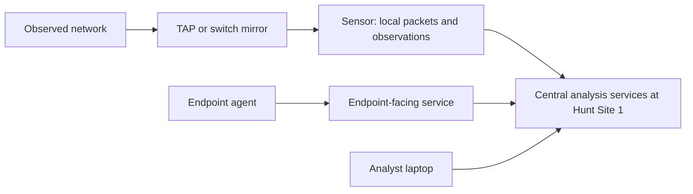

# JCHK Start Here

The **Joint Cyber Hunt Kit (JCHK)** is a portable collection and analysis system for defensive cyber work. It combines network sensors, servers, firewalls, switches, analyst laptops, and software. The sensors observe traffic; shared applications turn observations into searchable evidence; analysts use the evidence to investigate what happened.

You do not need prior JCHK knowledge to begin. This guide explains the system from its purpose through its physical wiring, software, deployment, daily use, and shutdown. Technical terms are defined as they appear and collected in [[JCHK Glossary]].

## The idea to keep in mind

The kit has **three different kinds of paths**:

1. **Evidence collection:** copied network traffic reaches sensors, which record packets and produce observations. Endpoint agents supply a separate source of host evidence.
2. **Analysis and access:** central applications at Hunt Site 1 store/search relevant data; analysts reach those applications from their laptops, often at the separate Analyst Site.
3. **Management and deployment:** administrators configure equipment and install services over dedicated management/provisioning paths.

A working path does not prove the other two work. For example, a reachable hardware-management page does not establish that a sensor is capturing traffic. Start with [[JCHK What the Kit Is]], then [[JCHK Sites and System Architecture]] and [[JCHK Data Journey and Resilience]].

This is a conceptual evidence/access diagram, not a cable diagram. **TAP** means traffic access point; a **switch mirror** is a configured copy of switch traffic. A **sensor** processes copied traffic. An **agent** is software running on a monitored endpoint. The actual physical and routed paths are explained in the linked notes.

## Suggested first reading path

| Step | Read | What you should understand afterward |
| --- | --- | --- |
| 1 | [[JCHK What the Kit Is]] | What the system is for and what the supplied baseline represents |
| 2 | [[JCHK Sites and System Architecture]] | Analyst Site versus Hunt Sites, and where the central servers live |
| 3 | [[JCHK Data Journey and Resilience]] | Packets, metadata, endpoint telemetry, and different failure effects |
| 4 | [[JCHK Network Fundamentals]] | Addresses, subnets, VLANs, routing, names, time, and management paths |
| 5 | [[JCHK Kit Inventory and Packaging]] and [[JCHK Servers Sensors and Flex Nodes]] | Which physical device performs each job |
| 6 | [[JCHK Cabling and Deployment States]] | Why staging and operational wiring differ |
| 7 | [[JCHK Firewalls and WireGuard]] and [[JCHK Mission Partner Connectivity]] | How sites connect and how mission endpoints reach selected services |
| 8 | [[JCHK Virtual Machines and Containers]] and [[JCHK JCRS-D and Kubernetes]] | How software shares the central hardware |
| 9 | [[JCHK Software Map and Baseline]] and [[JCHK Security Onion Architecture]] | How the tools and data pipelines fit together |
| 10 | [[JCHK Deployment Roadmap]] | The dependencies needed to build a usable kit |
| 11 | [[JCHK Mission Workflow]] and [[JCHK Security Onion Investigation Workflow]] | How to turn validated collection into an investigation |
| 12 | [[JCHK Capstone Practice]] | Whether you can explain, check, and troubleshoot the complete path |

Read one step at a time. When a term is unfamiliar, open [[JCHK Glossary]], then return to the paragraph. Before consulting detailed address or cable tables, read [[JCHK Source Discrepancies]] so you know which values conflict in the supplied materials.

## Complete note map

### 01 Foundations

- [[JCHK What the Kit Is]] — mission, system boundaries, variants, and version context.
- [[JCHK Sites and System Architecture]] — the four-site arrangement and component placement.
- [[JCHK Data Journey and Resilience]] — evidence types, movement, and outage implications.
- [[JCHK Virtual Machines and Containers]] — physical hosts, guest systems, containers, and laptop virtualization.
- [[JCHK JCRS-D and Kubernetes]] — shared runtime, orchestration, storage objects, and platform services.

### 02 Hardware

- [[JCHK Kit Inventory and Packaging]] — stacks, cases, backpacks, and major quantities.
- [[JCHK Servers Sensors and Flex Nodes]] — SN 7100, SN 9000, SN 3100, and flexible compute roles.
- [[JCHK Analyst Workstations and Accessories]] — laptop capabilities, local tools, and supporting equipment.
- [[JCHK Storage Capacity and Retention]] — raw versus usable space, evidence retention, and performance limits.

### 03 Networks and Cabling

- [[JCHK Network Fundamentals]] — prerequisite networking explained from first principles.
- [[JCHK Network Address Plan]] — source-labeled subnet and host reference tables.
- [[JCHK Firewalls and WireGuard]] — firewall interfaces, the VPN hub/spokes, routes, and verification.
- [[JCHK Mission Partner Connectivity]] — the separate MISSION interface, DMZ, translated connections, and trust.
- [[JCHK Cabling and Deployment States]] — connection purposes, cable families, and the staging-to-operations transition.
- [[JCHK Hunt Site 1 Cabling]] — cluster, infrastructure, management, provisioning, and capture connections.
- [[JCHK Remote and Analyst Site Cabling]] — Hunt Sites 2/3 and Analyst Site connection tables.

### 04 Software

- [[JCHK Software Map and Baseline]] — software layers, availability, and choosing the right tool.
- [[JCHK Service Portal and Identity]] — service access, FreeIPA, identity, names, time, and trust.
- [[JCHK Security Onion Architecture]] — manager, receivers, search nodes, Fleet, and sensors.
- [[JCHK Security Onion Investigation Workflow]] — an evidence-based investigation from question to finding.
- [[JCHK Sensor Health and Packet Loss]] — health signals, capture failures, performance, and gaps.
- [[JCHK Elastic Agent and Fleet]] — endpoint telemetry, enrollment, data paths, and certificates.
- [[JCHK Velociraptor Endpoint Forensics]] — targeted endpoint evidence collection and validation.
- [[JCHK TAPs and Traffic Visibility]] — observation placement, media/speed, directions, and SPAN alternatives.
- [[JCHK Analyst Tools and Evidence Handling]] — tool selection, artifacts, preservation, and isolation.
- [[JCHK Collaboration and Reporting]] — cases, coordination, findings, confidence, and handoffs.

### 05 Lifecycle

- [[JCHK Deployment Roadmap]] — the full build sequence and its prerequisites.
- [[JCHK Hardware Baselines]] — firmware, storage, interfaces, and configuration consistency.
- [[JCHK Analyst Laptop Preparation]] — installation media, laptop setup, and verification.
- [[JCHK Switch Initialization]] — model-specific setup, imports, and configuration checks.
- [[JCHK JAKD Deployment]] — the Provisioner, virtual adapters, configuration, and playbooks.
- [[JCHK Post-Deployment Readiness]] — final connectivity, trust, time, licenses, and readiness gates.
- [[JCHK Startup]] — dependency-aware start order and service validation.
- [[JCHK Shutdown and Pack-Out]] — orderly stopping, evidence considerations, disassembly, and inventory.
- [[JCHK Troubleshooting and Recovery]] — diagnosis, targeted changes, and rebuild/reset boundaries.

### 06 Practice

- [[JCHK Mission Workflow]] — observation planning, collection validation, investigation, and mission closure.
- [[JCHK Capstone Practice]] — exercises, answer checks, and an evidence worksheet.

### 07 Reference

- [[JCHK Glossary]] — 310 terms and grouped definitions, including ambiguous acronyms.
- [[JCHK Sources]] — all 18 PDFs and eight cabling images, with original-file links and citation conventions.
- [[JCHK Source Discrepancies]] — known conflicting source values and how to treat them.

## Find an answer by symptom or task

| Your question | Begin here |
| --- | --- |
| Why do I see several cables connected to one sensor? | [[JCHK Cabling and Deployment States]] |
| Is the Analyst Site the place where all the servers run? | [[JCHK Sites and System Architecture]] |
| Why can I open a login page but see no traffic? | [[JCHK Sensor Health and Packet Loss]] |
| Why is the VPN healthy but one tool unreachable? | [[JCHK Firewalls and WireGuard]] |
| Why can an endpoint not enroll in Fleet? | [[JCHK Elastic Agent and Fleet]] and [[JCHK Mission Partner Connectivity]] |
| How long will packets be retained? | [[JCHK Storage Capacity and Retention]] |
| Which listed address should I trust? | [[JCHK Network Address Plan]] and [[JCHK Source Discrepancies]] |
| Can I fix this by factory-resetting or redeploying? | [[JCHK Troubleshooting and Recovery]] |
| What order do I turn things on or off? | [[JCHK Startup]] and [[JCHK Shutdown and Pack-Out]] |

## Check your understanding

Try explaining these without looking at the diagram:

1. Where are the three SN 7100 nodes in the supplied standard layout?
2. How do full packet capture and metadata differ?
3. Why does hardware management need a different path from packet capture?
4. Which connections are temporary during provisioning?
5. What is the difference between a WAN transport connection and the Hunt 1 MISSION connection?
6. Why does a successful login or green tunnel indicator not prove operational readiness?
7. Why can raw disk capacity not directly establish retention time?

> [!success]- Answer guide
> 1. Hunt Site 1.
> 2. Capture preserves observed packet bytes; metadata summarizes selected properties of activity.
> 3. The management controller administers hardware; the monitor interface receives copied traffic for analysis.
> 4. The provisioning interfaces and staging-only intersite links are temporary; the temporary WAN is replaced when using operational transport.
> 5. WAN transports intersite tunnels; MISSION provides selected partner-to-DMZ service communication.
> 6. Those checks cover only one dependency; data sources, routes, rules, services, storage, time, and trust still matter.
> 7. Parity/replication, reserved space, traffic rate, overhead, and retention policy affect usable space and duration.

## How to use the source references

These notes describe the supplied **provisional v0.6.1 material**, with cabling diagrams dated 22 July 2026. They distinguish stable concepts from examples, future capabilities, and conflicting defaults. They do not claim to have inspected a running kit.

Page references are **PDF viewer page numbers starting at 1**, not the printed footer labels. Original files remain outside the vault at their supplied locations, so those external file links require the files to stay available on this computer. Internal Obsidian links, definitions, tables, and conceptual diagrams are self-contained.

The training is equipment familiarization; completing these notes does not itself validate a cyber work-role qualification. The source documents' procedures are summarized as educational content. No deployment, firewall, endpoint-agent, reset, or shutdown command was executed to produce the guide.

Sources for course scope and learning progression: [[JCHK Sources#CO|Course overview]], PDF pp. 13–18; [[JCHK Sources#SG|Student guide]], PDF pp. 7–17. Every topic adds its own more specific source references.
